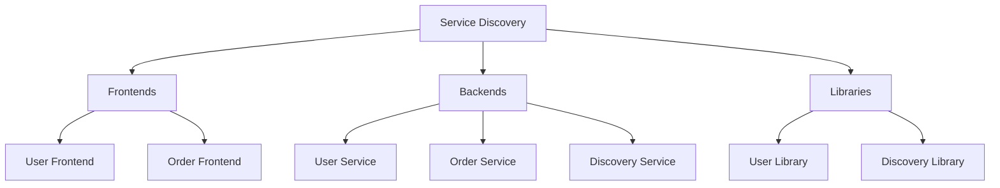

# Project Structure

## Overview
This document outlines the project structure for the multi-frontend workspace built using React, TypeScript, and Vite.

## Project Components
The project consists of the following main components:

- **Frontends**: User Frontend and Order Frontend
- **Backends**: User Service, Order Service, and Discovery Service
- **Libraries**: User Library and Discovery Library

## Structure Diagram
Below is a diagram representing the project structure:

## Conclusion
This document serves as a guide for understanding the structure of the project and its components.